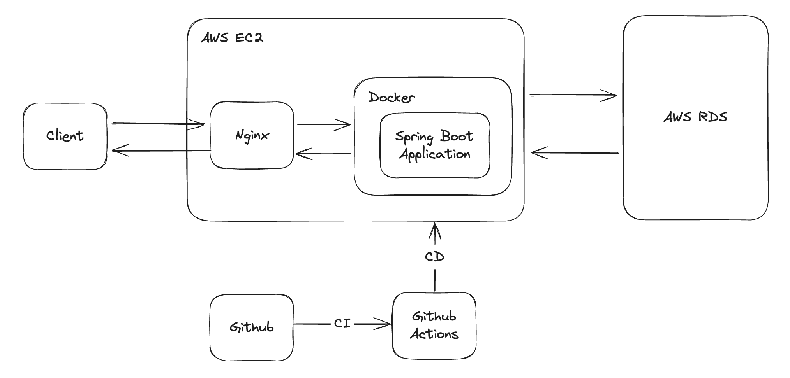
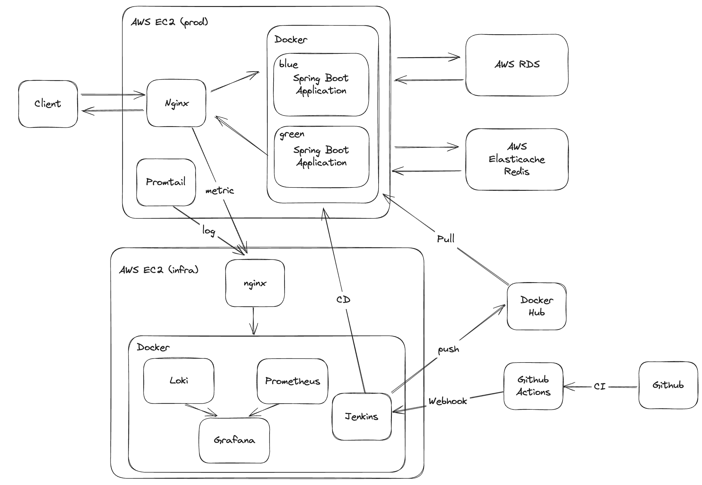
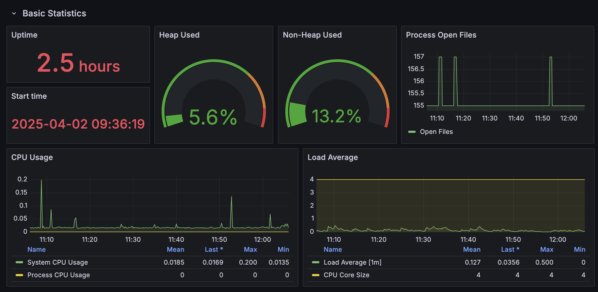
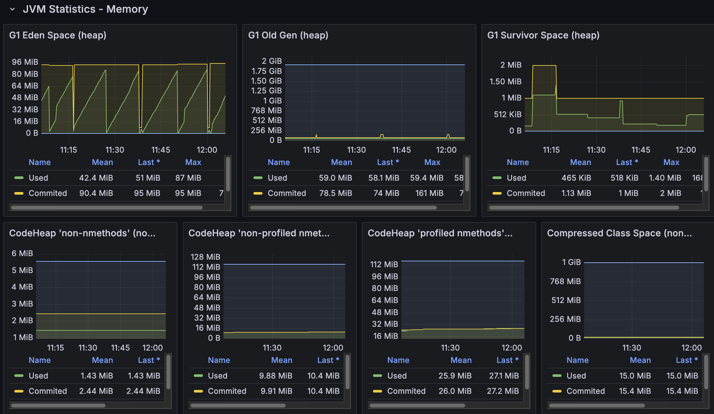
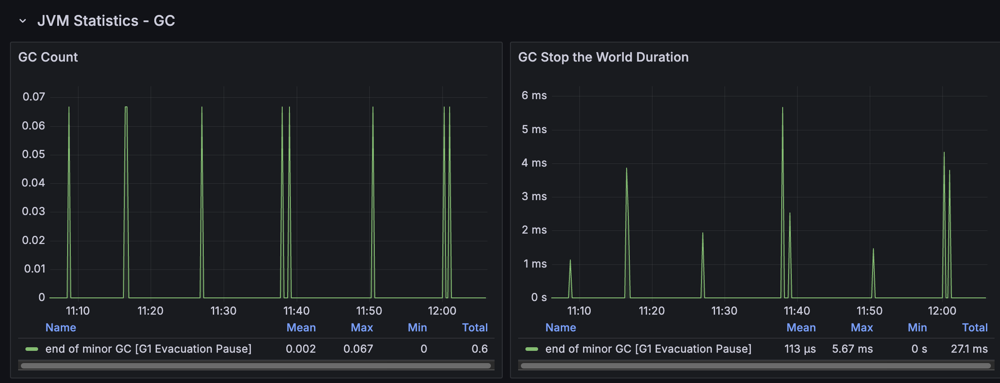
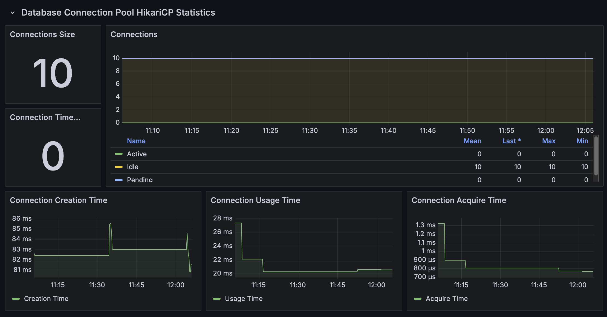
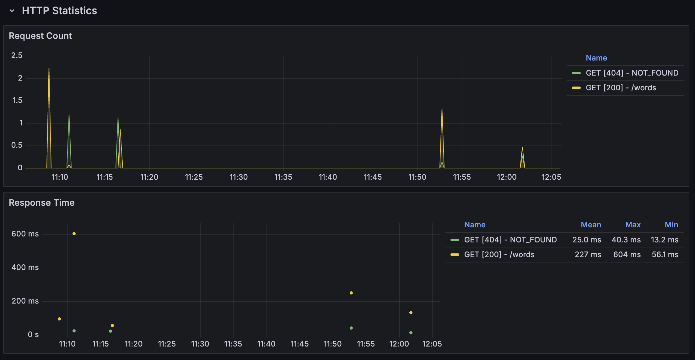
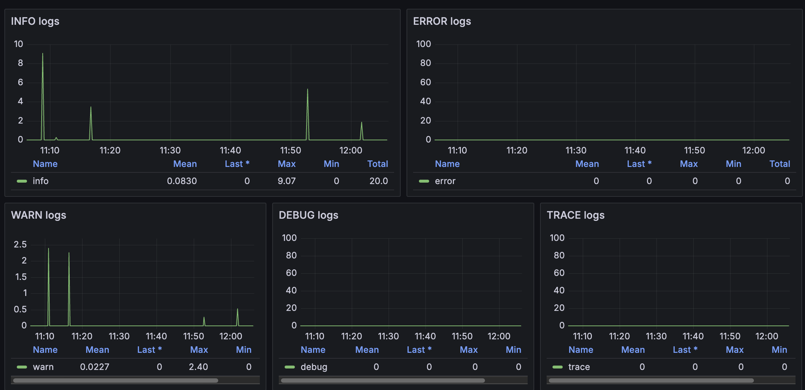
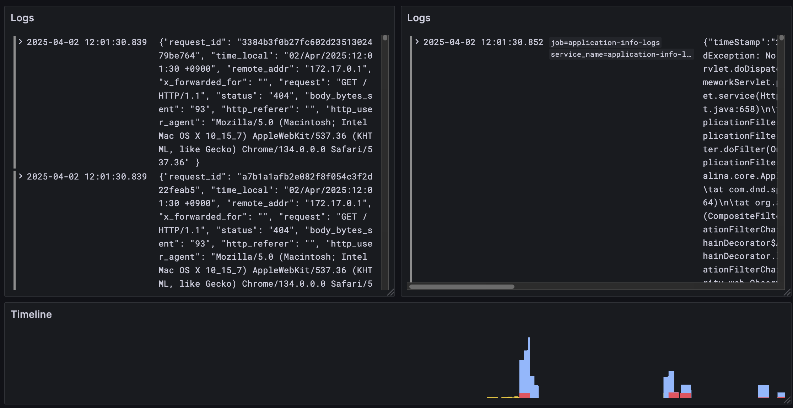
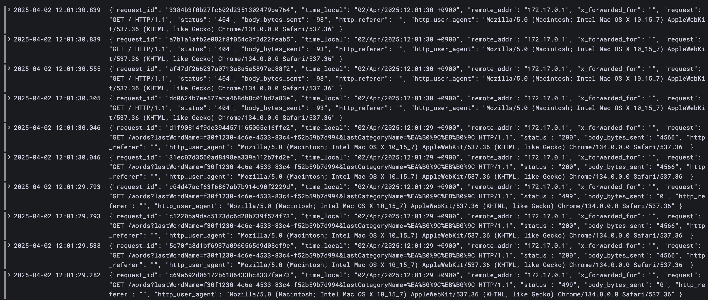

# 소통의 간격을 줄이다, SPACE D 🪐
SPACE D는 여백, 간격, 우주를 의미하는 **SPACE** 와 ‘Designer, Developer’의 **D** 를 합친 합성어로,  
**‘알아듣지 못하는 용어로 생긴 소통의 간격을 줄인다'** 는 의미를 담고 있습니다.  

## 서비스 소개

 

## 고도화

해당 레포지토리는 2024.07.01 ~ 2024.08.24일까지 진행한 팀 프로젝트 [SPACE D](https://github.com/dnd-side-project/dnd-11th-10-backend)를 혼자 고도화한 레포지토리 입니다.

---

### 기존 담당 파트

- 회원 CRUD 
- 용어 CRUD
- 패키지 구조 통일
- 인증 / 인가
- 북마크 CRUD
- 댓글 CRUD 
- 이미지 Read 
- 신고 CRUD 
- 퀴즈 CRUD
- Swagger 공통 설정
- 담당 파트 문서화

### 고도화 내용

- 쿼리 최적화 및 DB 인덱스 추가
- 불필요한 트랜잭션 제거
- 문서화 라이브러리 변경 (Swagger -> Spring Rest Docs)
- 토큰 방식 변경 (JWT -> JWE)
- 캐시 적용
- 코드 컨벤션 적용
- 테스트 추가
- 패키지 구조 변경
- 도메인 개념을 좀 더 명확하게 확립
    - 학습 도메인을 기존 퀴즈 도메인과 통합
    - 퀴즈 도메인을 퀴즈 도메인과 오늘의 퀴즈 도메인으로 분리
- CI / CD 변경
	- CI : Github actions, CD : Jenkins
- 인프라 구조 변경
	- 블루/그린 배포 적용
  - 인프라 서버, 개발 서버, 운영 서버 분리
- 미완성 기능 구현
    - Quiz, TodayQuiz
- 모니터링 기능 추가
    - 로그 : Promtail & Loki, 메트릭 : Prometheus, 시각화 : Grafana

## 인프라 구조 

### 이전 

### 리팩터링 후 

## 모니터링

- Spring Actuator & Prometheus로 스프링 부트 애플리케이션 메트릭 모니터링

- Promtail & Loki로 스프링 부트 애플리케이션 로그 & nginx 로그 모니터링
